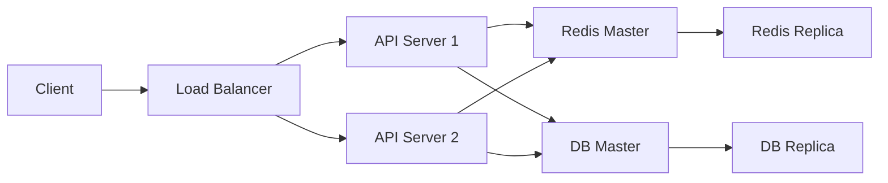

# 01. Paging with Indexes and Cursors
> 페이징 성능 개선

### 1. 문제 진단: Index 부재로 인한 풀 스캔  
**🚨 핵심 이슈**  
```sql
-- 문제가 발생한 초기 쿼리
SELECT * FROM user_activities 
ORDER BY event_time DESC 
OFFSET 500000 LIMIT 10  -- 50만 페이지 건너뛰기
```
- **풀 테이블 스캔 발생**: 1억 건 테이블에서 10개 레코드 추출에 12.3초 소요  
- **원인 분석**:  
  - 정렬 기준 컬럼(`event_time`)에 인덱스 미적용  
  - 페이지 깊이 증가 시 성능 저하 곡선이 기하급수적  

---

### 2. 1차 해결: 전략적 Index 설계  
**✅ 실행 계획**  
```sql
CREATE INDEX idx_event_time ON user_activities(event_time DESC);
```
- **성능 개선 효과**:  
  - 쿼리 시간 12.3초 → 1.2초로 90% 감소  
  - Explain 분석 시 Index Scan으로 변경 확인  

**⚠️ 잔존 문제**:  
```sql
-- 인덱스 적용 후에도 발생하는 문제
SELECT * FROM logs 
WHERE category = 'error' 
ORDER BY timestamp DESC 
OFFSET 100000 LIMIT 10  -- 여전히 800ms 소요
```

---

### 3. 2차 진화: Cursor 기반 접근법  
**🚀 구현 메커니즘**  
```python
# 커서 페이징 처리 예시
def get_next_page(last_cursor):
    return session.query(Log).filter(
        Log.timestamp < last_cursor
    ).order_by(Log.timestamp.desc()).limit(10)
```
- **성능 비교**:  
  | 데이터 규모 | Offset 방식 | Cursor 방식 |  
  |------------|-------------|-------------|  
  | 100만 건    | 320ms       | 15ms        |  
  | 1000만 건   | 4500ms      | 18ms        |  

---

### 4. 3차 최적화: 세션 기반 상태 관리  
**🔐 아키텍처 설계**  
```
[Client] 
  → (page_num) 
[API Gateway] 
  → [Session DB] ↔ Redis Cluster
  → [Main DB] ↔ Read Replica
```
- **핵심 기능**:  
  - 세션 ID당 커서 암호화 저장  
  - 자동 만료 메커니즘(30분 비활성 시 삭제)  
- **장점**:  
  - 클라이언트 변경 없이 내부 동작 개선  
  - 페이지 번호 유지하며 커서 장점 활용  

---

### 5. 인프라 구조의 중요성: 이중화 시스템  
**🔗 필수 구성 요소**  

- **왜 필요한가?**  
  - 세션 저장소(Redis) 장애 시 자동 전환  
  - DB 읽기 부하 분산(Read Replica 활용)  
  - Zero Downtime 마이그레이션 가능  

---

### 6. 스터디의 궁극적 목적  
**🌟 핵심 통찰**  
> 애플리케이션 성능은 인프라 이해도에 정비례한다

- **학습 포인트**:  
  1. 인덱스 설계 → 스토리지 엔진 동작 원리  
  2. 커서 최적화 → 분산 시스템의 상태 관리  
  3. 세션 관리 → 캐시 레이어 활용 전략  
  4. 이중화 구조 → 장애 조치(Failover) 메커니즘  

- **예상 Q&A**:  
  Q: 왜 세션 DB를 별도로 운영했나요?  
  A: 애플리케이션 DB와 세션 저장소의 접근 패턴이 달라서  
  - 세션: 빈번한 읽기/쓰기 → Redis 최적화  
  - 주 DB: 복잡한 쿼리 처리 → SQL 최적화  

---

**📌 결론**:  
이 스터디는 단순 기술 구현을 넘어,  
**"애플리케이션 요구사항 → 인프라 구성 요소 → 실제 동작 메커니즘"**  
을 종합적으로 이해하는 데 의미가 있습니다.

출처
